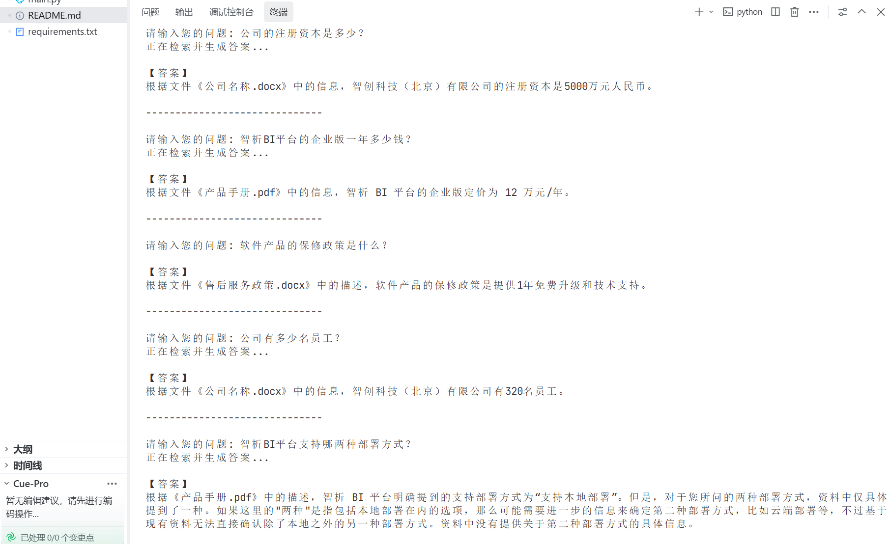

# 本地知识库问答系统（通义千问 + Chroma）
## 环境准备

1. 安装 Python 3.13+
2. 创建虚拟环境并安装依赖：
   ```bash
   pip install -r requirements.txt
   ```
3. 配置 API Key：
   在项目根目录创建 `.env` 文件，添加：
   ```
   DASHSCOPE_API_KEY=你的阿里云API密钥
   ```
4. 将文档放入 `./documents` 目录（支持 PDF、Word）
5. 运行程序：
   ```bash
   python main.py
   ```
6. 使用 `--rebuild` 参数重建索引(就是如果有新文件加入文件夹必须要重新执行一下命令)：
   ```bash
   python main.py --rebuild
   ```

## 使用说明

1. 首次运行会自动读取 documents 文件夹中的文档并建立向量索引
2. 输入您的问题，按回车获得答案
3. 输入 `exit` 或 `quit` 或ctrl+c退出程序
本项目实现了一个完全本地化的文档问答工具，所有文档内容不会离开你的电脑，仅将必要的文本片段发送给通义千问 API 进行嵌入和答案生成。

## 自测报告



## 核心特性
- 支持 PDF (.pdf) 和 Word (.docx/.doc) 文档
- 基于通义千问 Embedding 模型（text-embedding-v2）生成向量
- 使用 Chroma 向量数据库 100% 本地存储
- 交互式命令行界面，可直接提问并获得带来源引用的答案
- 支持通过 `--rebuild` 参数强制重建索引

---

## 架构理解

### 1.1 处理 PDF 文件时的数据流程

```
用户上传PDF文件 → 本地读取文件 → PyPDFLoader解析 → 文本分块 → 本地生成向量 → 存入Chroma数据库
                                                            ↓
用户提问 → Chroma向量检索 → 提取相关文本片段 → 发送给通义千问API → 返回答案
```

**数据离开电脑的步骤：**
- **文本嵌入步骤**：将文本片段发送给通义千问 Embedding API（text-embedding-v2）生成向量
- **问答生成步骤**：将检索到的相关文本片段和用户问题发送给通义千问大模型 API（qwen-max）生成答案

**数据没有离开电脑的步骤：**
- PDF 文件的读取和解析（在本地使用 PyPDFLoader）
- 文本分块（在本地使用 RecursiveCharacterTextSplitter）
- 向量存储和检索（使用本地 Chroma 数据库）

### 1.2 传统做法 vs 本系统做法

| 对比维度 | 传统做法（上传整个文件到云端） | 本系统做法（本地处理） |
|---------|---------------------------|---------------------|
| **优点1** | 无需本地计算资源 | **隐私保护**：文档内容完全不离开本地 |
| **优点2** | 支持超大型文档 | **响应速度快**：嵌入只需做一次，后续查询极快 |
| **优点3** | 部署简单 | **离线可用**：首次索引后可离线运行 |
| **优点4** | 无需本地存储 | **成本可控**：API调用次数可精确控制 |
| **缺点1** | 隐私风险高 | 需要本地有 Python 环境 |
| **缺点2** | 网络依赖强 | 首次启动需要较长时间建立索引 |
| **缺点3** | 每次查询都要传完整上下文 | 本地需要足够的磁盘空间存储向量 |

---

## 隐私与安全分析

### 2.1 API 调用泄露的信息分析

**嵌入 API（text-embedding-v2）调用时：**
- 泄露内容：文本片段的语义向量（经过模型编码后的数值表示）
- 风险等级：中等。原始文本内容不直接暴露，但通过向量可能反推原始文本（理论上可行，实际难度较高）
- 额外信息：API 调用时间、调用频次、用户 IP 地址

**大模型 API（qwen-max）调用时：**
- 泄露内容：用户问题 + 检索到的相关文本片段
- 风险等级：较高。原始文档内容以明文形式发送
- 额外信息：API 调用时间、调用频次、用户 IP 地址

**降低隐私风险的方法：**
1. 使用本地部署的 embedding 模型（如 sentence-transformers）
2. 使用本地部署的大模型（如 LLaMA、Qwen 本地版）
3. 对发送的文本进行脱敏处理
4. 使用差分隐私技术添加噪声
5. 实施数据保留策略，API 提供商应及时删除调用数据

### 2.2 完全不向第三方发送文件内容的替代方案

需要替换的组件：

| 原组件 | 替代方案 |
|--------|---------|
| DashScopeEmbeddings | 使用本地 Embedding 模型，如 `HuggingFaceEmbeddings` 配合 `sentence-transformers/all-MiniLM-L6-v2` |
| ChatTongyi | 使用本地大模型，如 Ollama 配合 `qwen2.5` 或 `llama3`，通过 `LangChain` 的 `OllamaLLM` 接口 |
| Chroma（可选） | 可保留，因为是本地存储；如果需要完全离线可使用 `FAISS` |

---

## OpenClaw 理念对照

### 3.1 渐进式披露策略的体现

本系统在以下地方体现了"渐进式披露"策略：

1. **向量检索的 k 参数**（`RETRIEVER_K = 4`）
   - 只返回最相关的 4 个文本块，不是全部文档
   - 随着对话深入，可以考虑增加 k 值以获取更多上下文

2. **文本分块机制**（`CHUNK_SIZE = 500`）
   - 不将整个文档发送给大模型，而是分成小块
   - 每次只暴露与问题最相关的片段

3. **提示词模板设计**
   - 系统提示词中明确告知："如果参考资料中没有相关信息，请直接说无法回答"
   - 不假设大模型应该知道答案，而是基于提供的资料

4. **交互式问答**
   - 用户可以逐步深入提问
   - 系统每次只回答当前问题，保持简洁

### 3.2 支持 Excel 数据分析的扩展

如果要支持用户上传 Excel 并进行数据分析（仍不上传文件），需要增加以下组件：

1. **数据读取组件**
   - 使用 `pandas` 读取 Excel 文件
   - 使用 `openpyxl` 作为引擎

2. **数据分析本地模型**
   - 使用 `pandasai` 或 `databricks` 等库进行本地数据分析
   - 或者使用支持数据分析的本地大模型

3. **结构化输出解析**
   - 解析大模型返回的 Python 代码或 SQL
   - 在本地执行并返回结果

架构示意图：
```
Excel文件 → pandas读取 → 数据概要生成 → 本地分析模型 → 执行分析 → 返回结果
```

---

## LangChain 使用总结（20分）

### 4.1 本系统使用的 LangChain 组件

| 组件 | 用途 |
|------|------|
| `PyPDFLoader` | 加载 PDF 文档 |
| `RecursiveCharacterTextSplitter` | 将长文本分割成小块 |
| `Chroma` | 本地向量数据库存储和检索 |
| `DashScopeEmbeddings` | 通义千问文本嵌入模型 |
| `ChatTongyi` | 通义千问大语言模型 |
| `ChatPromptTemplate` | 构建提示词模板 |
| `RunnablePassthrough` | RAG 管道中的数据传递 |
| `StrOutputParser` | 解析大模型输出为字符串 |

### 4.2 RAG 管道架构

```python
rag_chain = (
    {"context": retriever | format_docs, "question": RunnablePassthrough()}
    | prompt_template
    | llm
    | StrOutputParser()
)
```

这个管道的工作流程：
1. `retriever` 接收用户问题，从向量数据库中检索相关文档
2. `format_docs` 将检索到的文档格式化为上下文字符串
3. `prompt_template` 将上下文和问题组合成完整提示词
4. `llm`（ChatTongyi）生成回答
5. `StrOutputParser` 解析输出为字符串

### 4.3 LangChain 带来的优势

1. **统一的接口**：不同 Provider 的模型可以无缝切换
2. **链式调用**：通过 `|` 运算符轻松组合各个组件
3. **组件丰富**：文档加载器、文本分割器、向量存储等开箱即用
4. **可扩展性**：易于替换底层模型或添加新功能

---


